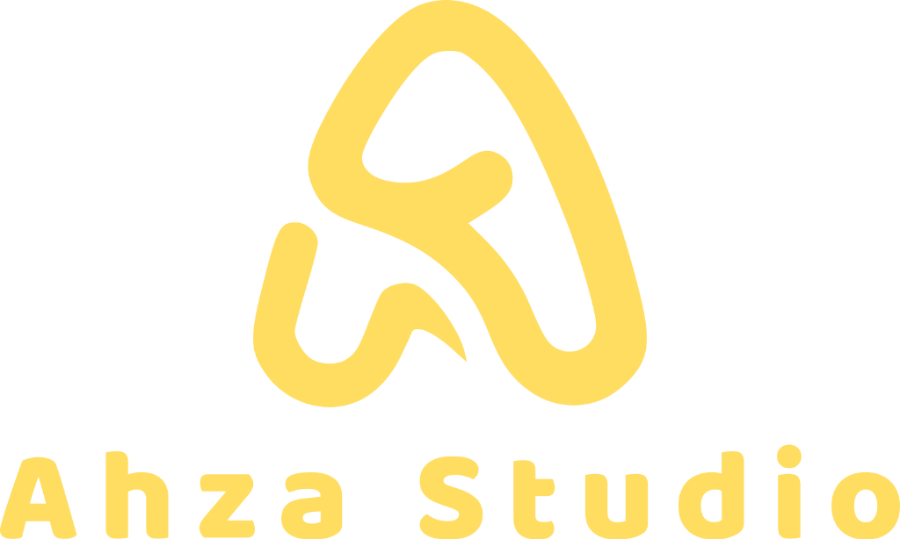

# Deep Learning Land Cover Toolbox v2.1.0

## Deskripsi
Toolbox ArcGIS Pro untuk klasifikasi tutupan lahan otomatis menggunakan model Deep Learning (AI). Dirancang khusus untuk memproses Citra Landsat 8 (Level 2 Surface Reflectance) dengan akurasi tinggi dan standar klasifikasi SNI Indonesia.

## Fitur Utama
- **01. Smart Installer**: Deteksi otomatis hardware GPU NVIDIA/CPU dan instalasi library (PyTorch, FastAI) yang kompatibel.
- **02. Manage Landsat 8**: Otomatisasi pembuatan *Mosaic Dataset* dari folder data mentah (USGS Collection 2).
- **03. Deep Learning Classification**: Klasifikasi piksel berbasis AI dengan output Raster dan Vektor (Polygon).
- **04. Force Composite Raster**: Menggabungkan band-band spektral secara paksa untuk memastikan integritas data Deep Learning.
- **05. Check License Status**: Sistem aktivasi lisensi berbasis cloud (Supabase) dengan ID Mesin unik.

## Persyaratan Sistem
- **Software**: ArcGIS Pro 3.0 atau lebih baru (Direkomendasikan 3.3/3.4/3.5/3.6).
- **Hardware**: 
  - RAM: Minimal 16GB (32GB direkomendasikan).
  - GPU: NVIDIA GTX/RTX Series dengan VRAM minimal 4GB (Opsional, tapi sangat direkomendasikan).
  - Koneksi Internet untuk aktivasi lisensi dan instalasi library pertama kali.

## Panduan Instalasi & Penggunaan
Panduan lengkap tersedia di: [https://dl.ahzastudio.web.id/docs/](https://dl.ahzastudio.web.id/docs/)

## Kontak & Dukungan
Dikembangkan oleh **Ahza Studio**.
- **Admin**: Ardi Abu Ridho (+62 822-5476-0769)
- **Website**: [ahzastudio.web.id](https://ahzastudio.web.id)

---
*© 2026 AHZASTUDIO WEB ID. All Rights Reserved.*
